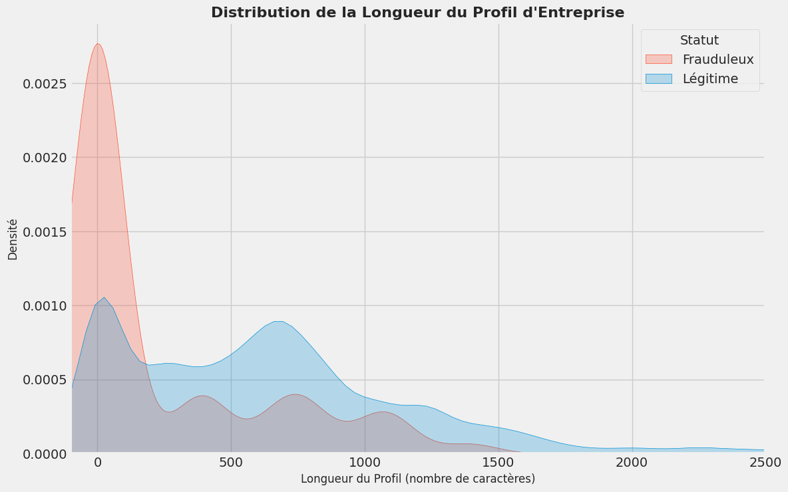
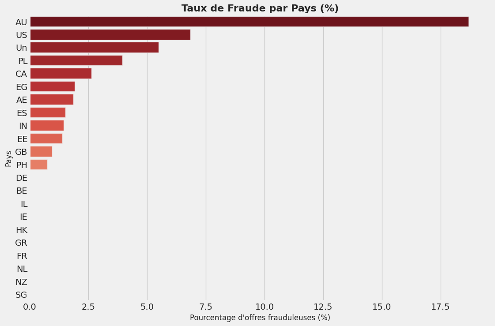

# Analyse des Fausses Offres d'Emploi : Nettoyage et Exploration

## 1. Problème Business

Les plateformes de recherche d'emploi sont de plus en plus la cible d'offres frauduleuses visant à escroquer les candidats (phishing, vol de données, fausses promesses d'embauche). Ce projet a pour but d'analyser en profondeur un jeu de données contenant de vraies et de fausses offres d'emploi afin d'identifier les caractéristiques et les signaux d'alerte qui distinguent les annonces illégitimes.

L'objectif final est de transformer des données textuelles brutes et non structurées en un jeu de données propre et exploitable, prêt pour la construction d'un modèle de détection.

## 2. Dataset

Le jeu de données utilisé provient de Kaggle et contient 18 000 offres d'emploi avec 18 caractéristiques, y compris des informations sur l'entreprise, la description du poste, les exigences et une étiquette indiquant si l'offre est frauduleuse ou non.

- **Source :** [Real / Fake Job Posting Prediction on Kaggle](https://www.kaggle.com/datasets/shivamb/real-or-fake-fake-jobposting-prediction)

## 3. Objectifs de l'Analyse

Ce projet vise à répondre aux questions suivantes à travers l'exploration et la visualisation des données :

*   **Q1 :** Quelles sont les caractéristiques les plus souvent manquantes dans les fausses offres d'emploi par rapport aux offres légitimes (logo de l'entreprise, fourchette de salaire, etc.) ?
*   **Q2 :** Existe-t-il des mots-clés ou des expressions suspects dans les descriptions de poste ou les profils d'entreprise des annonces frauduleuses ?
*   **Q3 :** Comment le type de contrat (CDI, temps partiel), le niveau d'expérience requis ou le niveau d'éducation diffèrent-ils entre les vraies et les fausses offres ?
*   **Q4 :** Quelles sont les variables les plus prometteuses (features) à construire pour un futur modèle de machine learning ?

## 4. Méthodologie

1.  **Chargement et Exploration Initiale :** Compréhension de la structure du dataset, des types de données et des statistiques de base.
2.  **Nettoyage Approfondi des Données (Data Cleaning) :**
    -   Gestion stratégique des valeurs manquantes (imputation, suppression).
    -   Standardisation des données textuelles et catégorielles.
    -   Extraction d'informations à partir de colonnes complexes.
3.  **Analyse Exploratoire des Données (EDA) :**
    -   Visualisation des distributions des variables clés.
    -   Analyse des corrélations entre les caractéristiques et le statut frauduleux.
    -   Analyse de texte pour identifier les mots fréquents.
4.  **Ingénierie de Caractéristiques (Feature Engineering) :**
    -   Création de nouvelles variables pertinentes (ex: longueur de la description, présence d'une adresse email, etc.).

## 5. Outils et Librairies

*   **Langage :** Python
*   **Librairies :**
    *   Analyse de données : Pandas, NumPy
    *   Visualisation : Matplotlib, Seaborn
    *   Traitement de texte (potentiel) : NLTK, spaCy

## 6. Résultats et Visualisations Clés

L'analyse complète, menée dans le notebook `analysis.ipynb`, a révélé plusieurs signaux d'alerte majeurs permettant de distinguer les offres frauduleuses.

### Insight 1 : La "Stratégie du Faible Effort"

Les fraudeurs investissent un minimum d'effort dans la rédaction de leurs offres. Cela se traduit par des champs de texte souvent vides ou très courts. L'absence d'un profil d'entreprise est l'indicateur le plus puissant.



### Insight 2 : L'Australie, une Cible à Haut Risque

L'analyse du taux de fraude par pays a montré que, bien que les États-Unis aient le plus grand volume de fraudes, c'est en **Australie** que le risque est le plus élevé, avec un taux de fraude alarmant de **18.7%**.



### Insight 3 : Les Signaux d'Alerte Classiques

- **Absence de Logo :** 82% des offres légitimes ont un logo, contre seulement 33% des offres frauduleuses.
- **Type de Contrat :** Les offres `Part-time` (Temps partiel) sont proportionnellement les plus risquées (9.3% de fraude).
- **Télétravail :** Les offres frauduleuses sont presque deux fois plus susceptibles de proposer du télétravail.

## 7. Comment Lancer le Projet

1.  Clonez le repository :
    ```bash
    git clone https://github.com/manfoya/Fake-Job-Posting-Detection-Analysis.git
    ```
2.  Naviguez dans le dossier du projet :
    ```bash
    cd Fake-Job-Posting-Detection-Analysis
    ```
3.  Lancez le notebook Jupyter `analysis.ipynb` pour voir l'analyse complète.